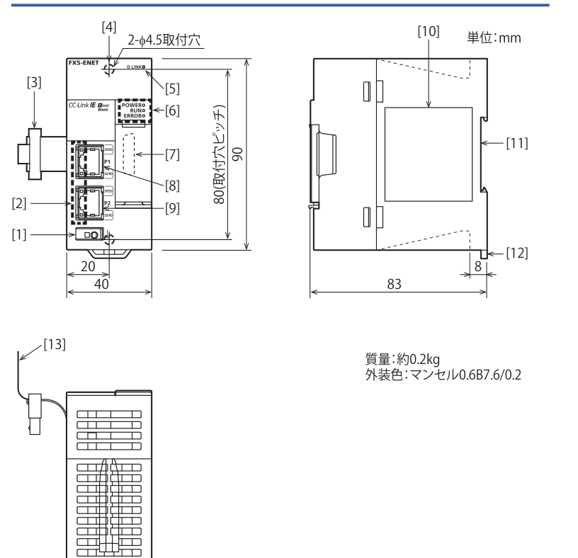
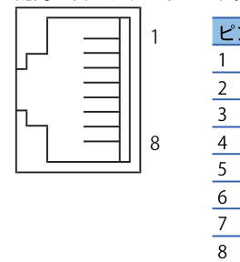
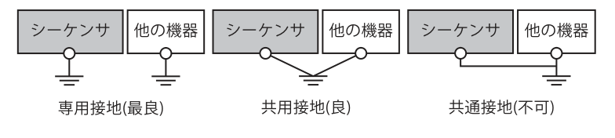
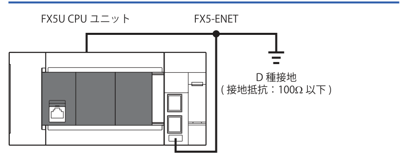
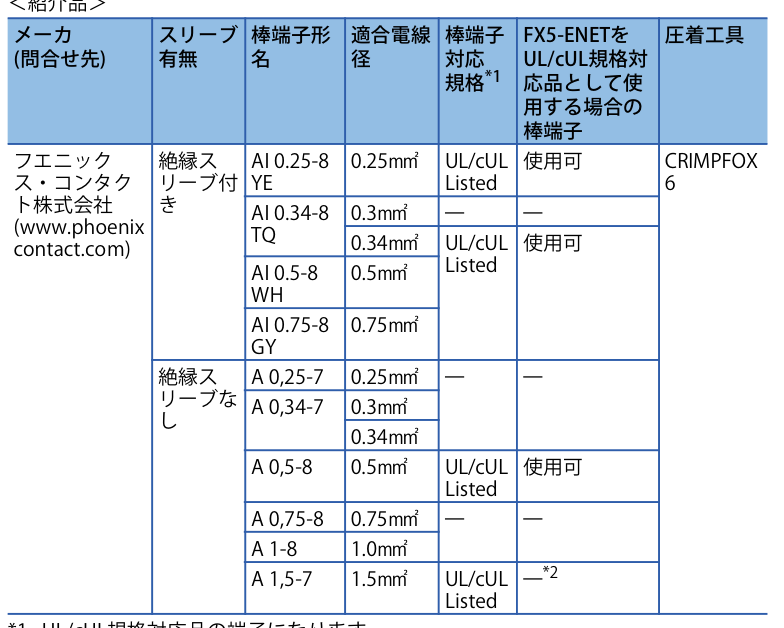
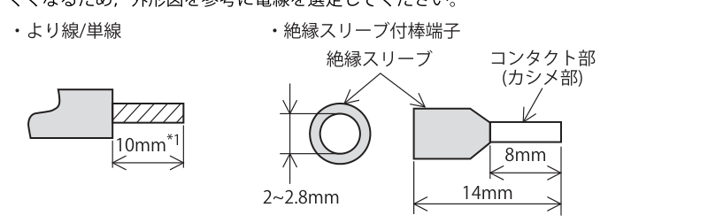
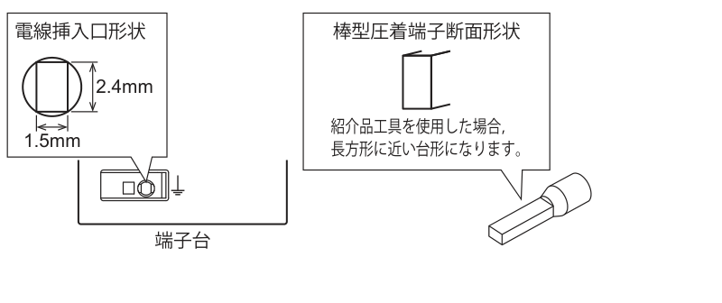

# MELSEC iQ-F FX5-ENET ハードウェアマニュアル

> **出典**: 三菱電機 `【三菱】MELSEC iQ-F FX5-ENET ハードウェアマニュアル_ib0800596jh.pdf`
> **マニュアル番号**: IB(NA)-0800596 / **副番**: H / **作成日付**: 2025年3月
> 原本はA3・1枚もの（8パネル折り）。本MDは印刷面の読み順（上段左→右、下段左→右）で再構成しています。
> 図は `images/` に切り出して格納。

このたびは，本製品をお買い上げいただき，誠にありがとうございました。

本マニュアルは，本製品の各部名称，外形寸法，取付け，および仕様について述べたものです。本製品の取扱いや操作などにつきましてはご使用の前に，本マニュアルおよび関連製品マニュアルをお読みいただき，機器の知識や安全の情報，注意事項のすべてについて習熟してからご使用ください。また，製品に付属しているマニュアルは必要なときに取り出して読めるように大切に保管するとともに，必ず最終ユーザまでお届け頂きますようにお願いいたします。

**商標について**: 本文中における会社名，システム名，製品名などは，一般に各社の登録商標または商標です。本文中で，商標記号(™, ®)は明記していない場合があります。本マニュアルは，お断りなしに仕様を変更することがありますのでご了承ください。

© 2018 MITSUBISHI ELECTRIC CORPORATION

---

## 目次

- [安全上のご注意](#安全上のご注意)
- [関連マニュアル](#関連マニュアル)
- [対応規格](#対応規格)
- [1. 製品概要](#1-製品概要)
  - [1.1 同梱製品の確認](#11-同梱製品の確認)
  - [1.2 外形寸法，各部名称](#12-外形寸法各部名称)
  - [1.3 LEDの表示内容](#13-ledの表示内容)
- [2. 取付け](#2-取付け)
- [3. 配線](#3-配線)
  - [3.1 使用コネクタとケーブル](#31-使用コネクタとケーブル)
  - [3.2 接地](#32-接地)
  - [3.3 端子台への接続（棒端子・電線）](#33-端子台への接続棒端子電線)
- [4. 仕様](#4-仕様)
  - [4.1 対応CPUユニット](#41-対応cpuユニット)
  - [4.2 対応ソフトウェアパッケージ](#42-対応ソフトウェアパッケージ)
  - [4.3 一般仕様](#43-一般仕様)
  - [4.4 電源仕様](#44-電源仕様)
  - [4.5 性能仕様](#45-性能仕様)
- [保証について](#保証について)

---

## 安全上のご注意

**(ご使用の前に必ずお読みください。)**

本製品を当社が指定しない方法で使用する場合，本製品によって提供される保護が損なわれる可能性があります。
本マニュアルでは，安全注意事項のランクを「⚠警告」，「⚠注意」として区分してあります。

| ランク | 意味 |
|---|---|
| **⚠ 警告** | 取扱いを誤った場合に，危険な状況が起こりえて，死亡または重傷を受ける可能性が想定される場合。 |
| **⚠ 注意** | 取扱いを誤った場合に，危険な状況が起こりえて，中程度の傷害や軽傷を受ける可能性が想定される場合および物的損害だけの発生が想定される場合。 |

なお，⚠注意に記載した事項でも，状況によっては重大な結果に結びつく可能性があります。いずれも重要な内容を記載していますので，必ず守ってください。

### 【設計上の注意】⚠ 警告

- 外部電源の異常，シーケンサの故障などでも，必ずシステム全体が安全側に働くようシーケンサの外部で安全回路を設けてください。誤動作，誤出力により，事故の恐れがあります。
  - 非常停止回路，保護回路，正転/逆転などの相反する動作のインタロック回路，位置決め上限/下限など機械の破損防止のインタロック回路などは，シーケンサの外部で構成してください。
  - CPUユニットが，ウォッチドッグタイマエラーなどの自己診断機能で異常を検出したときは，全出力をOFFします。またCPUユニットで検出できない入出力制御部分などの異常時は，出力制御が不能になることがあります。このとき，機械の動作が安全側に働くよう外部回路や機構の設計を行ってください。
- ネットワークが交信異常になったときの各局の動作状態については，各ネットワークのマニュアルを参照してください。誤出力，誤動作により事故の恐れがあります。
- 運転中のシーケンサに対する制御(データ変更)を行うときは，常にシステム全体が安全側に働くよう，プログラム上でインタロック回路を構成してください。また，運転中のシーケンサに対するその他の制御(プログラム変更，パラメータ変更，強制出力，運転状態変更(状態制御))を行うときは，マニュアルを熟読し，十分に安全を確認してから行ってください。確認を怠ると，操作ミスにより機械の破損や事故の原因になります。
- 外部機器から遠隔地のシーケンサに対する制御では，データ交信異常によりシーケンサ側のトラブルにすぐに対応できない場合もあります。プログラム上でインタロック回路を構成するとともに，データ交信異常が発生したときのシステムとしての処置方法を外部機器とCPUユニット間で取り決めてください。
- 通信ケーブルが断線した場合は，回線が不安定になり，複数の局でネットワークが交信異常になる場合があります。交信異常が発生しても，システムが安全側に働くようにプログラム上でインタロック回路を構成してください。誤出力または誤動作により，事故の恐れがあります。

### 【設計上の注意】⚠ 注意

- CPUユニットと増設ユニットの電源は，同時に入切りしてください。

### 【セキュリティ上の注意】⚠ 注意

- ネットワーク経由による信頼できないネットワークや機器からの不正アクセス，DoS攻撃，コンピュータウイルスその他のサイバー攻撃に対して，シーケンサ，およびシステムのセキュリティ(可用性，完全性，機密性)を保つため，ファイアウォールやVPNの設置，コンピュータへのアンチウイルスソフト導入などの対策を盛り込んでください。

### 【立上げ･保守時の注意】⚠ 注意

- 分解，改造はしないでください。故障，誤動作，火災の原因となることがあります。修理については，三菱電機システムサービス株式会社にお問い合わせください。
- 本品を落下させたり，強い衝撃を与えないでください。破損の原因になります。

### 【廃棄時の注意】⚠ 注意

- 製品を廃棄するときは，産業廃棄物として扱ってください。

### 【輸送時の注意】⚠ 注意

- 本品は精密機器のため，輸送の間は専用の梱包箱や振動防止用パレットを使用するなどして一般仕様の値を超える衝撃を避けてください。本品の故障の原因になることがあります。
- 輸送後，本品の動作確認および取付け部などの破損確認を行ってください。

> 【取付け上の注意】は [2. 取付け](#2-取付け)，【配線上の注意】は [3. 配線](#3-配線) に記載。

---

## 関連マニュアル

| マニュアル名称 | マニュアル番号 | 内容 |
|---|---|---|
| MELSEC iQ-F FX5 ユーザーズマニュアル(通信編) | SH-082624 | CPUユニット内蔵およびEthernetユニットの通信機能に関する内容を記載しています。 |
| MELSEC iQ-F FX5 BACnetリファレンスマニュアル | SH-082217 | EthernetユニットのBACnet機能に関する内容を記載しています。 |
| MELSEC iQ-F FX5 Ethernetユニットユーザーズマニュアル | SH-082024 | FX5-ENETの機能について記載しています。 |
| MELSEC iQ-F FX5S/FX5UJ/FX5U/FX5UC ユーザーズマニュアル(ハードウェア編) | SH-082451 | FX5 CPUユニットの性能仕様，配線，取付けや保守などのハードウェアに関する詳細事項について記載しています。 |
| MELSEC iQ-F FX5 プログラミングマニュアル(命令/汎用FUN/汎用FB編) | JY997D54701 | プログラムで使用できる命令や関数の仕様について記載しています。 |

必要な製品マニュアルや文書については，最寄りの三菱電機システムサービス株式会社または当社の支社，代理店にご相談ください。または，下記のURLからデータをダウンロードしてください。
<www.mitsubishielectric.co.jp/fa/ref/ref.html?kisyu=plcf&manual=download_all>

---

## 対応規格

FX5-ENETは，**EU指令(EMC指令)，UL規格(UL，cUL)，UKCAマーキング**に対応しています。

FX5-ENETをUL，cULに適合するためには，システム全体の外部電源(DC電源)に **LIM(Limited Energy Circuit)** または **UL 1310 Class 2に適合したSELV(safety extra-low-voltage)電源** を使用してください。

📖 詳細については，下記マニュアルを参照してください。
　MELSEC iQ-F FX5 Ethernetユニットユーザーズマニュアル

CPUユニットの規格対応については，総合カタログをご参照いただくか，別途弊社までお問い合わせください。

> **⚠ 注意** — 製品は一般工業環境下でご使用ください。

---

## 1. 製品概要

FX5-ENET形Ethernetユニット(以下FX5-ENETと略称)は，**CC-Link IEフィールドネットワークBasic(マスタ局)** および **汎用Ethernet** に接続するためのインテリジェント機能ユニットです。

### 1.1 同梱製品の確認

製品および付属品が同梱されているか確認してください。

| 品名 | 個数 |
|---|---|
| FX5-ENET形Ethernetユニット | 1 |
| 防塵シート | 1 |
| 安全にお使いいただくために | 1 |

### 1.2 外形寸法，各部名称

単位：mm　／　**質量：約0.2kg**　／　**外装色：マンセル0.6B7.6/0.2**
主要寸法：幅40（取付穴ピッチ20）× 高さ90（取付穴ピッチ80）× 奥行83（＋8）

| No. | 名称 |
|---|---|
| [1] | アース端子台(スプリングクランプ端子台)*1 |
| [2] | リンク状態表示LED |
| [3] | 増設ケーブル |
| [4] | 直接取付け用穴(2-φ4.5，取付けネジ: M4ネジ，締め付けトルク: 0.83~1.11N·m) |
| [5] | ネットワーク状態表示LED |
| [6] | 動作状態表示LED |
| [7] | 次段増設コネクタ |
| [8] | P1用モジュラージャック(RJ-45)(キャップ付) |
| [9] | P2用モジュラージャック(RJ-45)(キャップ付) |
| [10] | ネームプレート*2 |
| [11] | DINレール取付け用溝(DINレール: DIN46277 35mm幅) |
| [12] | DINレール取付用フック |
| [13] | 引抜タブ |

*1 ⏚（接地記号）は機能接地端子を示しています。
*2 📖マークは，より詳細な製品情報を下記マニュアルから確認できることを示しています。
　MELSEC iQ-F FX5 Ethernetユニットユーザーズマニュアル
　MELSEC iQ-F FX5S/FX5UJ/FX5U/FX5UCユーザーズマニュアル(ハードウェア編)
　マニュアルは，下記のURLからダウンロードしてください。
　<www.mitsubishielectric.co.jp/fa/ref/ref.html?kisyu=plcf&manual=download_all>

### 1.3 LEDの表示内容

| LED名称 | | LED色 | 状態 | 内容 |
|---|---|---|---|---|
| D LINK | | 緑 | 点灯 | 1台以上のリモート局と通信中 |
| | | | 消灯 | 全局異常(全リモート局と通信を行っていない) |
| POWER | | 緑 | 点灯 | 通電中 |
| | | | 消灯 | 停電中またはハードウェア異常 |
| RUN | | 緑 | 点灯 | 正常動作中 |
| | | | 消灯 | 異常発生中 |
| ERROR | | 赤 | 点灯 | 軽度または重度異常が発生中 |
| | | | 点滅 | 中度または重度異常が発生中 |
| | | | 消灯 | 正常動作中 |
| P1,P2 | SPEED | 緑 | 点灯 | リンクアップ中(100Mbps) |
| | | | 消灯 | リンクアップ中(10Mbps) |
| | SD/RD | 緑 | 点灯／点滅 | データ送受信中 |
| | | | 消灯 | データ未送信および未受信 |

---

## 2. 取付け

### 【取付け上の注意】⚠ 警告

- 取付け，配線作業などを行うときは，必ず電源を外部で全相とも遮断してから行ってください。感電，製品損傷の恐れがあります。
- 使用するCPUユニットのユーザーズマニュアル(ハードウェア編)に記載の一般仕様の環境で使用してください。ほこり，油煙，導電性ダスト，腐食性ガス(潮風，Cl₂，H₂S，SO₂，NO₂など)，可燃性ガスのある場所，高温，結露，風雨にさらされる場所，振動，衝撃がある場所で使用しないでください。感電，火災，誤動作，製品の損傷および，劣化の原因となることがあります。

### 【取付け上の注意】⚠ 注意

- 製品の導電部には直接触らないでください。誤動作，故障の原因となります。
- ネジ穴加工や配線工事を行うときに，切粉や電線屑をシーケンサの通風孔へ落とし込まないでください。火災，故障，誤動作の原因となります。
- 取付け配線工事中，切粉や配線クズなどの異物混入を防止するため，防塵シートを通風孔に貼り付けてください。また，工事完了後には放熱のために防塵シートは，必ず取りはずしてください。火災，故障，誤動作の原因となることがあります。
- 製品は平らな面に取り付けてください。取付け面に凹凸があると，プリント基板に無理な力が加わり不具合の原因になります。
- 製品の取付けは，DINレール，または取付けネジで確実に固定してください。
- 増設ケーブルは，所定のコネクタに確実に装着してください。接触不良により誤動作の原因となることがあります。
- 本製品は，CPUユニットまたはCPUユニットに接続されたユニットの次段増設コネクタに接続してください。

📖 取付けの詳細については，下記マニュアルを参照してください。
　MELSEC iQ-F FX5S/FX5UJ/FX5U/FX5UCユーザーズマニュアル(ハードウェア編)

---

## 3. 配線

### 【配線上の注意】⚠ 警告

- 取付け，配線作業などを行うときは，必ず電源を外部で全相とも遮断してから行ってください。感電，製品損傷の恐れがあります。
- 電線は，**温度定格80℃以上**のものをご使用ください。
- スプリングクランプ端子台タイプへの配線は，次の注意事項に従い適切に行ってください。感電，故障，短絡，断線，誤動作，製品損傷の恐れがあります。
  - 電線の端末処理寸法は，マニュアルに記載した寸法に従ってください。
  - より線の端末は，"ひげ線"が出ないようによじってください。
  - 電線の端末は，ハンダメッキしないでください。
  - 規定サイズ以外の電線や規定本数を超える電線を接続しないでください。
  - 端子台や電線接続部分には，外力が直接加わらないように，電線を固定してください。

### 【配線上の注意】⚠ 注意

- ノイズの影響により異常なデータがシーケンサに書き込まれた場合，シーケンサが誤動作をし，機械の破損や事故の原因になることがありますので次の項目を必ず守ってください。
  - 通信ケーブルは，主回路や高圧電線，負荷線，動力線などと束線したり，近接したりしないでください。**100mm以上離す**ことを目安としてください。
- 端子台，通信ケーブルに力が加わらない状態で使用してください。断線や故障の原因になります。

### 3.1 使用コネクタとケーブル

#### コネクタピン配列

FX5-ENETの10BASE-T/100BASE-TX接続コネクタ(RJ-45型モジュラージャック)のピン配列は次のようになります。

| ピン | 信号名 | 内容 |
|---|---|---|
| 1 | TP0+ | データ0を送信および受信(+側) |
| 2 | TP0- | データ0を送信および受信(-側) |
| 3 | TP1+ | データ1を送信および受信(+側) |
| 4 | TP2+ | データ2を送信および受信(+側) |
| 5 | TP2- | データ2を送信および受信(-側) |
| 6 | TP1- | データ1を送信および受信(-側) |
| 7 | TP3+ | データ3を送信および受信(+側) |
| 8 | TP3- | データ3を送信および受信(-側) |

#### 使用ケーブル

下記の規格を満たすEthernetケーブルで配線してください。

| Ethernet規格 | 仕様 |
|---|---|
| 100BASE-TX | カテゴリ5以上(STPケーブル*1) |
| 10BASE-T | カテゴリ3以上(STP/UTPケーブル*1) |

*1 シールド付ツイストペアケーブル
接続するケーブルは，ストレート/クロスケーブルが使用できます。

### 3.2 接地

接地は下記の項目を実施してください。

- 接地は **D種接地** を実施してください。(接地抵抗: 100Ω以下)
- 接地はできるだけ，**専用接地**としてください。専用接地がとれないときは，下図の"**共用接地**"としてください。

📖 詳細は，下記マニュアルを参照してください。
　MELSEC iQ-F FX5S/FX5UJ/FX5U/FX5UCユーザーズマニュアル(ハードウェア編)

- 接地点とシーケンサ間の距離をできるだけ近づけて，接地線を短くしてください。

#### FX5-ENETの接地

| 端子名称 | 内容 |
|---|---|
| FG(アース端子) | D種接地すること。(接地抵抗: 100Ω以下) |

### 3.3 端子台への接続（棒端子・電線）

FX5-ENETのFG端子はスプリングクランプ端子台です。端子台への接続は，単線/より線による方法と，棒端子による接続方法がありますので，次の仕様に従い適切に接続を行ってください。

#### 棒端子

端子台に適合する棒型圧着端子および，棒型圧着端子用工具を下表に示します。棒型圧着端子は使用する圧着工具によって形状が異なるため，**紹介品を使用してください**。これら以外のものを使用した場合，棒型圧着端子が抜けなくなり，端子台の破損が発生する恐れがありますので，棒型圧着端子が抜けることを十分確認の上，使用してください。また，FX5-ENETをUL/cUL規格対応品として使用する場合も紹介品を使用してください。

**＜紹介品＞** メーカ(問合せ先): フエニックス・コンタクト株式会社（<www.phoenixcontact.com>）／圧着工具: **CRIMPFOX 6**（全形名共通）

| スリーブ有無 | 棒端子形名 | 適合電線径 | 棒端子対応規格*1 | FX5-ENETをUL/cUL規格対応品として使用する場合の棒端子 |
|---|---|---|---|---|
| 絶縁スリーブ付き | AI 0.25-8 YE | 0.25mm² | UL/cUL Listed | 使用可 |
| 〃 | AI 0.34-8 TQ | 0.3mm² | — | — |
| 〃 | AI 0.34-8 TQ | 0.34mm² | UL/cUL Listed | 使用可 |
| 〃 | AI 0.5-8 WH | 0.5mm² | UL/cUL Listed | 使用可 |
| 〃 | AI 0.75-8 GY | 0.75mm² | UL/cUL Listed | 使用可 |
| 絶縁スリーブなし | A 0,25-7 | 0.25mm² | — | — |
| 〃 | A 0,34-7 | 0.3mm² ／ 0.34mm² | — | — |
| 〃 | A 0,5-8 | 0.5mm² | UL/cUL Listed | 使用可 |
| 〃 | A 0,75-8 | 0.75mm² | — | — |
| 〃 | A 1-8 | 1.0mm² | — | — |
| 〃 | A 1,5-7 | 1.5mm² | UL/cUL Listed | —*2 |

*1 UL/cUL規格対応品の端子になります。
*2 端子台のUL/cUL認証上の剥き線長さは8mmとなっているため，FX5-ENETをUL/cUL規格対応品として使用する場合は対応する棒端子をご使用ください。

> 原本の表（セル結合あり）はこちら: 

#### 接続電線数と電線サイズ

| 1端子あたりの接続電線数 | 単線，より線(材質: 銅線) | 絶縁スリーブ付棒端子 | 絶縁スリーブなし棒端子 | 温度定格 |
|---|---|---|---|---|
| 1本配線 | AWG24~16 (0.2~1.5mm²) | AWG23~19 (0.25~0.75mm²) | AWG23~16 (0.25~1.5mm²) | 80℃以上 |

#### 電線の端末処理

電線の先端から**10mm程度**被覆を剥き，はく離部分に棒型圧着端子を取り付けてください。電線はく離長さが長すぎると，導電部が端子台前面にはみ出すため，感電の恐れがあります。電線はく離長さが短すぎると，スプリングクランプ端子部に対して接触不良となる恐れがあります。

絶縁スリーブ付棒端子は，電線のシースの厚みによっては，絶縁スリーブに入れにくくなるため，外形図を参考に電線を選定してください。

寸法の目安: 電線はく離長さ 10mm*1 ／ 絶縁スリーブ付棒端子 全長14mm・コンタクト部(カシメ部)8mm・スリーブ外径2~2.8mm

*1 FX5-ENETをUL/cUL規格対応品として使用する場合，**8mm**にしてください。

以下の図にて，電線挿入口形状を確認し，それよりも小さな棒型圧着端子をご使用ください。また，棒型圧着端子の向きに注意して挿入してください。上記を守らない場合，端子の噛込みや端子台の破損が発生する恐れがあります。

電線挿入口形状: 高さ2.4mm × 幅1.5mm。紹介品工具を使用した場合，棒型圧着端子の断面は長方形に近い台形になります。

#### ケーブルの取付け

- **絶縁スリーブ付棒端子を使用する場合**
  絶縁スリーブ付棒端子のついた電線を電線挿入口に挿入し，押し込んでください。
- **単線，より線を使用する場合**
  端子台の開閉ボタンをマイナスドライバを使用して押し込んでください。開閉ボタンを押し込んだ状態で，電線を電線挿入口から突き当たるまで挿入し，開閉ボタンを離してください。

配線後，電線を軽く引っ張り，確実にクランプしていることを確認してください。

**＜参考＞**（マイナスドライバ）

| メーカ | 形名 |
|---|---|
| フエニックス・コンタクト株式会社 | SZS 0.4×2.5 VDE |

#### ケーブルの取りはずし

取りはずす電線の開閉ボタンを，マイナスドライバを使用して押し込んでください。開閉ボタンを押し込んだ状態で，電線を引き抜いてください。

---

## 4. 仕様

### 4.1 対応CPUユニット

| 機種名 | 対応状況*2 |
|---|---|
| FX5UJ CPUユニット | 初品から対応 |
| FX5U CPUユニット | Ver.1.110~ |
| FX5UC CPUユニット*1 | Ver.1.110~ |

*1 FX5UC CPUユニットと接続時は，**FX5-CNV-IFCまたはFX5-C1PS-5V**が必要です。
*2 CPUユニットのバージョンによって使用できる機能が異なります。詳細は，下記マニュアルを参照してください。
　📖 MELSEC iQ-F FX5 Ethernetユニットユーザーズマニュアル

### 4.2 対応ソフトウェアパッケージ

| ソフトウェア | 対応状況*1 |
|---|---|
| GX Works3 | FX5UJ CPUユニット: Ver.1.060N~ FX5U/FX5UC CPUユニット: Ver.1.050C~ |

*1 ソフトウェアのバージョンによって使用できる機能が異なります。詳細は，下記マニュアルを参照してください。
　📖 MELSEC iQ-F FX5 Ethernetユニットユーザーズマニュアル

### 4.3 一般仕様

下記以外の一般仕様は，接続するCPUユニットと同じです。
📖 一般仕様については，下記マニュアルを参照してください。
　MELSEC iQ-F FX5S/FX5UJ/FX5U/FX5UCユーザーズマニュアル(ハードウェア編)

| 項目 | 仕様 | 適用箇所 |
|---|---|---|
| 耐電圧 | AC500V 1分間 | 全端子一括とアース端子間 |
| 絶縁抵抗 | DC500V絶縁抵抗計にて10MΩ以上 | |

### 4.4 電源仕様

| 項目 | | 仕様 |
|---|---|---|
| 内部給電 | 電源電圧 | DC24V |
| | 消費電流 | 110mA |

### 4.5 性能仕様

📖 下記以外の性能仕様については，MELSEC iQ-F FX5 Ethernetユニットユーザーズマニュアルを参照してください。

| 項目 | 仕様 |
|---|---|
| 対応プロトコル | CC-Link IE フィールドネットワークBasic |
| | MELSOFT接続*1 |
| | SLMPサーバ(3E/1Eフレーム)*1 |
| | ソケット通信 |
| | シンプルCPU通信*1 |
| | BACnet/IP*1 |
| | MQTT通信*1 |
| | メール送信*1 |
| ポート数 | 2*2 |
| 入出力占有点数 | 8点 |
| 接続可能台数 | 1台 |

*1 各プロトコルを使用する場合，CPUユニット，FX5-ENETおよびソフトウェアそれぞれの対応バージョンが必要です。詳細は，下記マニュアルを参照してください。
　📖 MELSEC iQ-F FX5 Ethernetユニットユーザーズマニュアル
*2 **IPアドレスは2ポートで共用となるため，1つしか設定できません。**

---

## 保証について

本書によって，工業所有権その他の権利の実施に対する保証，または実施権を許諾するものではありません。また本書の掲載内容の使用により起因する工業所有権上の諸問題については，当社は一切その責任を負うことができません。

**機会損失，二次損失などへの保証責務の除外**

無償保証期間の内外を問わず，以下については当社責務外とさせていただきます。

1. 当社の責に帰すことができない事由から生じた障害。
2. 当社製品の故障に起因するお客様での機会損失，逸失利益。
3. 当社の予見の有無を問わず特別の事情から生じた損害，二次損害，事故補償，当社製品以外への損傷。
4. お客様による交換作業，現地機械設備の再調整，立上げ試運転その他の業務に対する補償。

### 安全にお使いいただくために

- この製品は一般工業を対象とした汎用品として製作されたもので，人命にかかわるような状況下で使用される機器あるいはシステムに用いられることを目的として設計，製造されたものではありません。
- この製品を原子力用，電力用，航空宇宙用，医療用，乗用移動体用の機器あるいはシステムなどの特殊用途への適用をご検討の際には，当社の営業窓口までご照会ください。
- この製品は厳重な品質体制の下に製造しておりますが，この製品の故障により重大な故障または損失の発生が予測される設備への適用に際しては，バックアップやフェールセーフ機能をシステム的に設置してください。

### インターネットによる情報サービス「三菱電機FAサイト」

三菱電機FAサイト <www.MitsubishiElectric.co.jp/fa>
三菱電機FAサイトでは，製品や事例などの技術情報に加え，トレーニングスクール情報や各種お問合わせ窓口をご提供しています。また，メンバー登録いただくとマニュアルやCADデータなどのダウンロード，eラーニングなどの各種サービスをご利用いただけます。

### 三菱電機FA機器電話技術相談

| 対象機種 | 電話番号 | 受付時間※1 |
|---|---|---|
| MELSEC iQ-F/FX | 052-725-2271 | 月曜～金曜 9:00～19:00（金曜は17:00まで） 土曜・日曜・祝日 9:00～17:00 |

※1 春季・夏季・年末年始の休日を除く

〒100-8310　東京都千代田区丸の内2-7-3（東京ビル）
